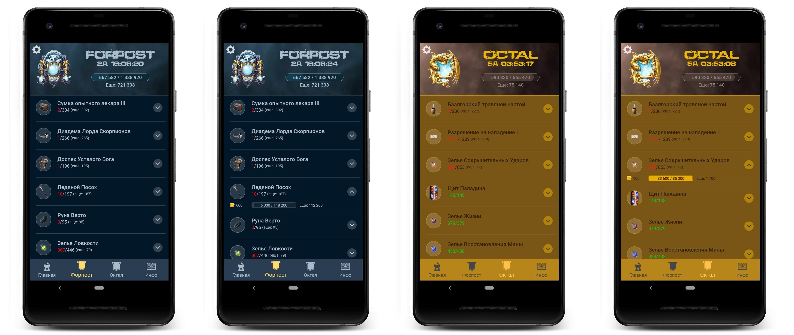
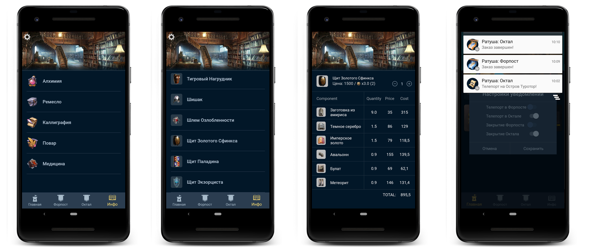

# Ratusha NeverLands;

For create this project i used:
- Language Kotlin;
- Pattern MVVM;
- Modules (Data/Device/Domain/Presentation)
- AndroidX;
- Kotlin Coroutines;
- Retrofit2 / Okhttp3;
- Dagger2 (DI);
- Room Database;
- LiveData;
- Livecycler;
- Firebase:
+ Analytics
+ Crashlytics
+ Cloud Messaging

Screens finished project. Release version 1.4;

<h3 align="center">
  
</h3>

<h3 align="center">
  
</h3>

<h3 align="center">
  
</h3>
